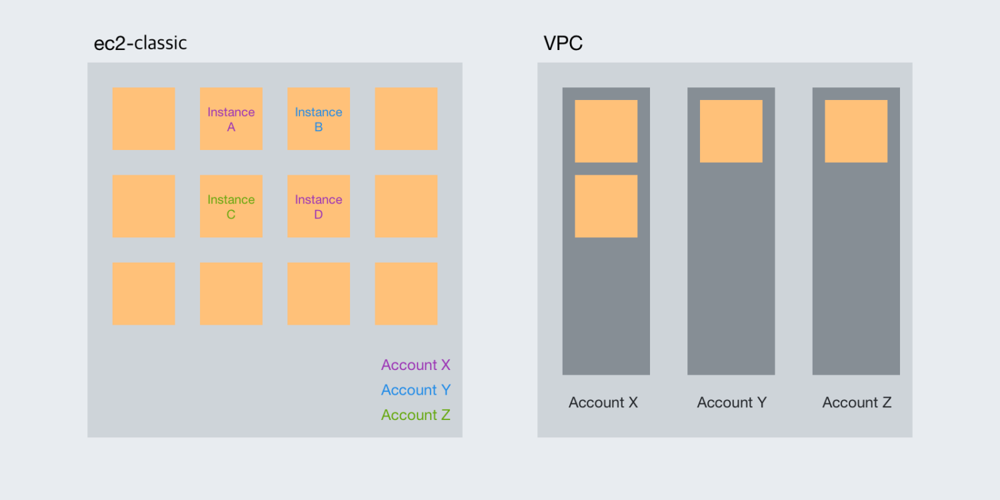

#### 12/22 - 12/28

#### `xcode`

- iOS 빌드는 xcworkspace (xcodeproj에서 죽을 써도 안된다)

#### `webpack`

- 모듈 번들러: 여러 파일들을 합쳐주는 라이브러리
- 스크립트 압축 + 최적화
- `webpack.config.js`
- Build mode => `production` 최적화, `development` 속도, `none` 기본
- html, js, css => loader + bundle

#### `홈페이지`

- 깃허브 블로그가 있지만 그냥 나만의 도메인을 걸고 하나 갖고 싶어서 준비해본다
- 타입스크립트로 시작했다가 `styled-component`에서도 타입을 선언해줘야 하는구나...
- 무서운 타입
- 깃허브 블로그 내용을 크롤해서 그려주는데 서브모듈로 블로그 레포를 받아와서 사용해볼까 고민중

#### `AWS VPC`

- node 3000 포트를 인바운드 허용했는데 접근이 안되는 API가 있다
- mysql를 호출하는 API이다
- 그렇다면 EC2 내부에서 node -> mysql를 허용해줘야 하는거 아닐까? 어떻게?
- 인바운드 설정을 변경하다 보면 `PROTOCOL_ENQUEUE_AFTER_FATAL_ERROR`라고 에러 로그가 찍혀있다. 아마도 node서버가 죽어버린것 같다. `forever`를 해뒀는데도… `forever restart`로 재실행해주면 정상 작동한다.

#### `OMF`

- [v0.0.2] 상태 그래프 표시
- [v0.0.3] 앱 최적화

#### `App Bundle`

-

```
최적화되지 않은 APK
경고:
이 APK로 인해 미사용 코드 및 리소스가 사용자에게 전송됩니다. Android App Bundle을 사용하면 앱 크기를 줄일 수 있습니다. 기기 설정에 따라 앱을 최적화하지 않으면 다운로드하여 사용자 기기에 설치되는 앱 용량이 필요 이상으로 커집니다. 크기가 큰 앱은 설치 성공률이 낮으며 사용자 기기의 저장용량을 많이 차지합니다.
해결방법:
Android App Bundle을 사용하여 앱을 기기 설정에 맞게 자동으로 최적화하거나 여러 개의 APK로 직접 관리하세요.
```

- APK = 전체 리소스 => 전체 사이즈 다 줄게 맞는거 골라입어
- App Bundle = 디바이스에 맞는 리소스만 설치 => 맞춤형
- 서명된 APK를 빌드해서 올리면 사용자가 Google Play에서 다운로드하는 방식
- 리소스를 올리면 Google Play에 사용자가 요청할때 필요 리소스만 모아서 서명 후 다운로드하는 방식
- 앱 번들 시 사이드로드(비정상적 APK 설치)한 경우 해당 기기에 필요한 리소스를 찾지 못해 앱 정상 작동 불가
- 이를 방지하고자 앱 실행 시 사이드로드 여부를 체크
- [더 작은 APK를 위한 App Bundle](https://medium.com/daangn/%EB%8D%94-%EC%9E%91%EC%9D%80-apk%EB%A5%BC-%EC%9C%84%ED%95%9C-android-app-bundle%EC%97%90-%EB%8C%80%ED%95%B4%EC%84%9C-345a656eee85)

##

#### 12/15 - 12/21

#### `OMF`

- 안드로이드 배포
- 다음에는 앱 빌드 크기를 최적화해야지

#### `대세는 핀테크`

- 인터넷 은행 이야기가 솔솔, `핀테크`를 접목하기 위한 과정 중 `생체인식이 필요하다`
- iOS의 FaceID, TouchID
- Android는 홍채인식, 지문인식, 얼굴인식
- 그러나 `react-native-touch-id`에서는 지문만 지원하는것 같다
- (추가) 생체인식 정보가 저장되어 있지 않은 경우 에러코드가 `이용할 수 없다` 라고 뜨는데, `등록되어 있지 않습니다` 라는 에러코드가 따로 있는 상황에서 왜 이렇게 나타나는지 당황스럽다

#### `AWS EC2`

- 1년 예약 인스턴스 스탠다드 구매
- `ssh -I {key.pem} {user}@{ip}`
- 환경변수 세팅 -> `export {변수명}={값}`
- 터미널 종료 시 서버도 같이 종료되는 현상 -> `node file.js &`
- 서버 종료 시 자동 재실행 -> `forever start file.js`
- 근데 `forever`가 ssh 연결이 끊어지면 같이 꺼진다? -> 확인해보니 그렇지는 않는듯하다

#### `AWS VPC`

- AWS: 사용자가 네트워크 환경을 직접 구축 할 수 있도록 지원하는 클라우드 서비스
- 클라우드 내부에 논리적으로 격리된 공간을 만들어서 각각의 리소스를 제어하며 가상의 네트워크 환경을 설정
- 커다란 공용 환경 -> 사용자에게 할당된 클라우드 공간
- VPC: 독립된 네트워크 환경을 구성할 수 있는 자원
- VPC를 사용하여 계정별로 할당된 공간을 논리적으로 격리하며 외부접근 제어
- 
- VPC -> Subnet -> 인스턴스(EC2)
- 192.168.0.0/32 ~ 192.168.0.0/16: 192.168.0.0부터 192.168.255.255까지 2^(32-n)개의 IP 사용
- 생성된 VPC의 IP 범위 안에서 서브넷 IP 생성하여 격리
- 여기서 서브넷을 1개만 생성하여도 상관없지만 2개를 생성하여 리소스를 동시에 배치하여 장애를 대응할 수 있도록 한다 => 멀티AZ
- [만들면서 이해하는 AWS VPC](https://www.44bits.io/ko/post/understanding_aws_vpc)

#### `RN: NativeModule`

- 지난주 작업하던 Orientation 네이티브 기능 안드로이드에도 적용
- 코르도바 경험이 도움이 되었다
- js에서 네이티브를 연결하는 Package와 해당 기능을 선언해둔 Module파일로 분리하여 개발

#### `한마디`

- 관계는 수평적으로 결정은 수직적으로
- 결정하는데 수평적이라면? 저는 이렇게 할거에요, 저는 이렇게 할래요
- 그럼 방향이 한 곳으로 모아질 수 있을까? 그래서 결정은 수직적
- 결정이 수직적이기 때문에 수평적인 관계 속에서 의사를 확실하게 전달해야하며 답정너가 아닌 결정과 책임이 전달되어야 할 것 같다

##

#### 12/8 - 12/14

#### `Docker`

- 개인 프로젝트를 위한 서버를 띄울 생각 중 시작하게된 도커
- 우선 Docker Hub에서 설치 후 Kitematic 까지 설치했는데...
- Image, container… 그래서 서버에 띄우려면 어떻게 만들어야 하는걸까

#### `redis`

- [11월 우아한 테크 세미나 - 우아한 레디스](https://www.youtube.com/watch?v=mPB2CZiAkKM&feature=youtu.be)

#### `React`

- 컴포넌트, 상태, 뷰
- `상태가 변함에 따라 컴포넌트를 렌더링하여 뷰한다`
- 상태를 관리하기 위한 redux
- 컴포넌트의 재활용을 위한 memoization
- 컴포넌트, 함수마다 memo, useCallback, useMemo를 해줘야 할까라는 고민이 있었다
- 리액트의 특성을 다시 생각하다보니 필요하다고 결론을 내렸다
- 클라이언트가 워낙 잘 되어있어서 그냥 렌더링이 다시 되는게 메모리에 저장해두는 것보다 효율적이지 않을까 생각했지만, 리액트의 목적은 `컴포넌트를 재활용`하여 화면을 그리는 것이며 이에 컴포넌트가 재활용 될 수 있도록 memoization을 해야한다
- 예제들을 찾아보면 이 상태에서 이게 메모이제이션이 효과가 있나? 하는 생각이 드는 것이 있다. 이건 결국 계속 재생성 되는 것 아닌가?
- `그러나 해당 컴포넌트가 어디서 언제 재활용 될 지 모르고 어떻게 부모 상태가 변하여 다시 렌더링 호출 될 지 모르기때문에 memoization을 예방하는 차원에서 사용한다`

#### `OMF`

- mysql 연동 및 파일 분리
- `nodejs`-`es6`-`babel` 도전하다 실패하여 `commonjs`+`es6` 짬뽕...
- `react-native-router-flux`를 `react-navigation`으로 마이그레이션
- `ssh root@{ip} -p {port}`
- 포트포워딩을 적용하지 않아서 서버에 접속 할 수 없었다… 긴 삽질
- Public IP가 있어야 내가 띄운 서버의 웹서버에 접속 할 수 있는 건가? (다른 클라우드서비스 쓰려했는데, 그냥 AWS 써야겠다)

#### `RN: NativeModule`

- 특정 화면 진입 시 화면 전환을 필요로 하여 `react-native-orientation` 라이브러리를 가져다 사용하였다.
- 그러다 문득 `어떻게 개발하셨어요?` 하는 질문에 `라이브러리 사용했어요` 라고 대답하고 나니 갑자기 회의감이 들었다.
- 과연 이걸 라이브러리를 사용해야만 했을까?
- 그렇게 리액트네이티브 문서를 찾아가 [Native-Module-iOS](https://facebook.github.io/react-native/docs/native-modules-ios)를 보고 하나씩 따라하기 시작했다.
- Angularjs로 하이브리드앱 개발 당시 네이티브 기능을 사용하기 위해 코르도바를 뜯어봤던 기억이 떠오르며...
- 막상 하다보니 그렇게 어려운 점은 없었고 오히려 필요한 기능만 작성된 코드를 사용할 수 있게 되었다
- 브릿지를 통해 네이티브와 스크립트를 연결하였고 해당 모듈을 사용하여 Orientation을 변경했다

##

#### 12/1 - 12/7

#### `애자일`

- `개발`해보고 `적용`해보고 `반응`을 보고 `실패`하는 `주기`를 `빠르게` 짧게 가져간다
- 개발자는 다양하게 개발할 수 있어서, 회사는 사용자가 원하는 것을 빠르게 찾을 수 있어서, 빠르게 짧게 투자했기 때문에 실패했을때 피해를 줄일 수 있다
- 앱에 애자일을 입히기 위해 걸림돌은 심사과정이다. 그래서 앱 기능을 웹뷰로 웹을 띄우는 방식으로 개발하였다. (토스)

#### `문서화`

- 코드
- 프로세스: 설치 프로그램
- 공개: 오픈API

#### `변수명`

- 명사로만
- 단복수 구분
- 전치사는 사용하지 않는다
- 짧고 간결

#### `오픈소스 열어보기`

- 결국 오픈소스도 기본 언어를 사용한 것
- 따라가다보면 필요한 부분만 꺼내 쓸 수 있음

#### `우아한 이동욱 개발자`

- `꾸준한 습관`

#### `fxts`

- 지난번 참여했던 스터디의 팡
- 그래서 독립한 스터디
- `fxjs`를 `ts`로 마이그레이션

#### `Github Issue`

- 자꾸 잊어버리는데 오픈소스 에러 나면 깃허브 이슈에서 검색부터
- 라이브러리 버전이 올라가면서 발생하는 에러
- 특정 버전을 골라서 사용해야 할까
- `package.json`에 `^1.2.3`처럼 모듈을 설치할 때마다 상위버전으로 업데이트 될 수 있는 여지를 주면 안되는걸까
