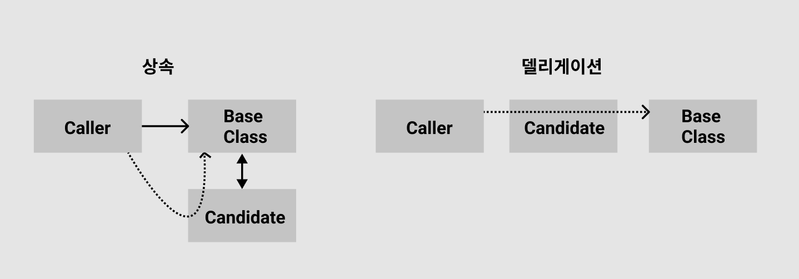

```markdown
[참고 도서]

- 다재다능 코틀린 프로그래밍
```

# 상속과 델리게이션

- 둘 다 객체지향 프로그래밍 디자인 방식으로 클래스를 다른 클래스로부터 확장시킨다
- 상속은 베이스 클래스에 귀속된다
- 델리게이션은 보다 유연하게 객체 자신이 처리해야 할 일을 다른 클래스의 인스턴스에게 위임한다

# 언제 델리게이션을 써야할까

- 상속과 델리게이션 어느 것이 더 유용할까

  - 클래스의 객체가 단순하게 다른 클래스의 객체를 `사용`하기만 한다면 `델리게이션`
  - 클래스의 객체가 다른 클래스의 객체의 자리에 `대체`되어야한다면 `상속`
    

  - 첫번째는 Candidate는 BaseClass를 상속받았고 Caller가 Candidate가 항상 들고 다니는 BaseClass에 접근한다
    - 자식클래스(Candidate)는 부모클래스(BaseClass)의 동작을 변경할 수 없다
    - 베이스 클래스의 외부 동작을 유지해야한다
  - 두번째는 Caller가 Candidate를 통해 BaseClass에 접근한다
    - 상속과는 다르게 인스턴스 분리가 가능하다
    - 필요에 따라 Candidate가 BaseClass를 변경해서 요청할 수 있다

# 델리게이션을 사용한 디자인

## 상속 디자인의 문제점

```kotlin
interface Worker {
	fun work()
	fun takeVacation()
}

open class JavaProgrammer: Worker {
	override fun work() = println("자바 개발자가 일하는 중")
	override fun takeVacation() = println("자바 개발자 휴가")
}
open class KotlinProgrammer: Worker {
	override fun work() = println("코틀린 개발자가 일하는 중")
	override fun takeVacation() = println("코틀린 개발자 휴가")
}

class Manager: JavaProgrammer()
```

1. Worker 인터페이스를 구현한 각각의 클래스에서 함수를 override했다
2. 이들을 관리하는 새로운 클래스 Manager를 추가하고 상속받았다
3. `JavaProgrammer` 를 상속받은 Manager에서는 부모클래스의 메소드를 호출한다

   ```kotlin
   val java = Manager()
   java.work() // 자바 개발자가 일하는 중
   ```

   ⇒ 이렇게 되면 Manager는 JavaProgrammer에만 한정된다

   ⇒ 한정된 클래스에서는 `KotlinProgrammer` 클래스도 같이 구현할 수 없다...

   ⇒ 따라서 Manager가 모든 클래스의 인터페이스인 Worker에 의존하도록 델리게이션을 사용한다

## 자바에서의 델리게이션을 어려웠다

- 한정된 상속을 풀어내고나 델리게이션을 구현하였다

  ```kotlin
  class Manager(val worker: Worker) {
  	fun work() = worker.work()
  	fun takeVacation() = worker.takeVacation()
  }

  val java = Manager(JavaProgrammer())
  java.work() // 자바 개발자가 일하는 중
  ```

  1. 델리게이션하려는 대상 인스턴스를 생성자로 전달하였다
  2. 그리고 그 인스턴스의 메소드를 각각 다시 구현하였다

  ⇒ 인자로 전달받은 인스턴스를 호출하므로써 한정적이지 않지만 각각의 메소드를 직접 구현해주어야한다

  - Worker에 메소드가 추가된다면 Manager에서 해당 메소드 호출을 위해 한번 더 추가 구현작업이 필요하다
    - 중복된 메소드 호출, DRY, OCP 원칙 위반

## 코틀린의 by 델리게이션

- 자바와는 다르게 `코틀린 컴파일러가 델리게이션 코드를 직접 요청`하도록 할 수 있다

  - 추가되는 메소드를 각각 다시 추가할 필요가없다

  ```kotlin
  class Manager(): Worker by JavaProgrammer()
  ```

  1. Manager는 아무런 메소드도 갖고 있지 않다
  2. JavaProgrammer을 이용해 Worker 인터페이스를 구현한 Manager
  3. Manager의 메소드는 by 키워드가 컴파일 시간에 델리게이션을 대신 해준다
  4. 여기서 `Manager는 델리게이션 했을뿐 타입이 JavaProgrammer인 것이 아니다`

     ```kotlin
     val person: JavaProgrammer = Manager() // Error: Type mismatch.
     ```

- `코틀린의 델리게이션을 사용하면 컴파일러가 내부적으로 메소드를 생성하고 요청한다`
  - 코틀린 컴파일러에 의해 메소드가 합성되었고 델리게이션에게 호출을 요청하는 것이다

# 파라미터 위임

## 기존의 델리게이션에서의 단점

```kotlin
class Manager(): Worker by JavaProgrammer()
```

1. Manager 인스턴스가 JavaProgrammer 인스턴스로 델리게이트 한다
   - Manager는 무조건 JavaProgrammer로만 요청할 수 있기에 다른 종류의 Worker 인터페이스를 구현한 클래스(ex. KotlinProgrammer)에게는 요청할 수 없다
2. `**Manager 인스턴스는 델리게이션에 접근 할 수 없다**`
   - Manager 클래스 안에 다른 메소드를 작성하여도 해당 메소드에서는 델리게이션을 통한 메소드 호출을 할 수 없다

## 델리게이션 생성자 파라미터

- 기존의 델리게이션 단점들을 해결하기 위해 `생성자로 델리게이션 파라미터`를 전달한다

  ```kotlin
  class Manager(val staff: Worker): Worker by staff {
  	fun meeting() = println("회의 ${staff.javaClass.simpleName}")
  }

  val java = Manager(JavaProgrammer())
  java.work() // 자바 개발자가 일하는 중
  java.meeting() // 회의 JavaProgrammer
  ```

  - 생성자 파라미터 `staff` 를 by 키워드로 델리게이션 한다
  - Manager 클래스의 meeting 메소드가 추가되었다
  - 이 메소드에서는 staff 파라미터를 통해 델리게이션 인스턴스의 메소드를 호출 할 수 있게 되었다
    - 델리게이션의 유연함
    - Manager에 추가 구현하지 않은 work 메소드를 호출하면 델리게이션 인스턴스의 work 메소드가 호출되고 추가 구현된 meeting 메소드를 호출하면 Manager 인스턴스의 메소드가 호출된다

# 메소드 충돌 관리

- 만약 델리게이션을 사용하는 클래스와 델리게이션 클래스에 동일한 이름의 메소드가 있다면?
  - 코틀린 상속에서 이런 상황을 해결하였다
  - 이름이 같은 메소드를 각각 하나씩 재구현해주었다
- 코틀린 컴파일러가 `델리게이션 클래스의 모든 인터페이스를 위한 랩퍼`를 만든다
  - 컴파일러가 메소드 요청을 할 수 있게 해주는 기능
- 델리게이션 클래스의 메소드를 이용하려는 클래스에서 다시 구현하려는 경우 `override 키워드`를 사용한다

  - 구현한 메소드에 우선순위를 주고 컴파일러가 해당 메소드에 대해 델리게이션 클래스의 랩퍼 메소드를 생성하지 않는다

    ```kotlin
    class Manager(val staff: Worker): Worker by staff {
    	override fun takeVacation() = println("특별휴가주기")
    }
    ```

    1. override를 사용해 해당 메소드가 델리게이션된 메소드가 아니라 인터페이스의 메소드를 직접 구현했다는 것을 명확하게 전달한다
    2. 코틀린 컴파일러가 Worker 인터페이스의 work 랩퍼 메소드만 생성할 것이다

# 델리게이션 주의사항

- 상속과는 다르게 델리게이션은 기존 클래스를 대체할 수 없다
  - Manager는 JavaProgrammer 인스턴스를 가지고 있을뿐 JavaProgrammer의 한 종류가 아니다
  - 델리게이션 인스턴스는 인터페이스 그 자체의 한종류이다
  - `val manager: Worker = Manager()`
    - 이는 델리게이션의 부작용인데 Manager가 Worker를 이용만 해야하는데 Worker로 취급되버린다...
- 생성자를 mutable로 정의하면 인스턴스와 델리게이션 참조가 다른 상황이 발생한다

  ```kotlin
  class Manager(var staff: Worker): Worker by staff {
    fun meeting() = println("회의 ${staff.javaClass.simpleName}")
  }

  val java = Manager(JavaProgrammer())
  java.work() // 자바 개발자가 일하는 중
  java.meeting() // 회의 JavaProgrammer
  java.staff = KotlinProgrammer()
  java.work() // 자바 개발자가 일하는 중
  java.meeting() // 회의 KotlinProgrammer
  ```

  1. Manager의 델리게이션를 전달하는 생성자를 var로 정의했다
  2. 처음에는 의도대로 JavaProgrammer로 동작한다
  3. `java.staff = KotlinProgrammer()` 뮤터블한 생성자 필드를 변경해버렸다
  4. 생성자를 변경했으니깐 델리게이션 메소드를 호출하는 `java.work()` 에서도 Kotlin이 나올것이라 기대했지만 Java가 나왔다
  5. 델리게이션 메소드가 아닌 직접 구현한 메서드에서 호출한 staff에는 Kotlin이 나왔다

  ⇒ 생성자를 변경한 것은 내부적으로 `this.staff = staff` 처럼 백킹 필드를 변경했을뿐이다

  ⇒ 델리게이션 메소드는 처음 만들어진 그대로를 참조하고 있다

  ⇒ 현재 Manager에서는 JavaProgrammer와 KotlinProgrammer 둘 다 사용중이다

# 변수와 속성 델리게이션

## 변수 델리게이션

- 클래스가 아니라 변수 자체를 델리게이션 할 수 있다

  ```kotlin
  // 델리게이션 클래스
  package 패키지경로
  import kotlin.reflect.KProperty

  class Delegation(var content: String) {
    operator fun getValue(thisRef: Any?, property: KProperty<*>) = "$content 에 이걸 더해서 가져오기"
    operator fun setValue(thisRef: Any, property: KProperty<*>, value: String) {
      println(">>> property ${property.name}") // yourName
      content = value
    }
  }

  // 사용하는 곳
  import 패키지경로.Delegation

  var yourName: String by Delegation("이 값을 델리게이션")
  println(yourName) // 이 값을 델리게이션 에 이걸 더해서 가져오기
  yourName = "변경"
  println(yourName) // 변경 에 이걸 더해서 가져오기
  ```

- 델리게이션 인스턴스를 통해 변수를 델리게이션해서 사용할 수 있게 되었다

## 속성 델리게이션

- 객체의 속성값에도 델리게이션을 사용할 수 있다
- 기존 데이터를 파라미터로 받아서 속성값에 주는 델리게이션 인스턴스 인자로 넘겨주고 델리게이션이 반환하는 값이 속성이 된다

  ```kotlin
  class PostComment(dataSource: MutableMap<String, Any>) {
    val title: String by dataSource
  }
  var data = PostComment(mutableMapOf(
    "title" to "이름"
  ))
  ```

- 객체 전체를 델리게이션 하지 않아도 부분적으로 속성만 위임할 수 있다

# 빌트인 스탠다드 델리게이션

- 지연 델리게이션으로 객체의 생성이나 연산 실행이 실제 필요한 순간까지 지연시킨다
- observable 델리게이션은 속성의 값이 변경되는 순간을 지켜보고 있다가 핸들링 할 수 있다
- vatoable 델리게이션은 속성의 값을 변경 요청하는 순간을 핸들링하여 실제로 값의 변경을 허락 또는 거절 할 수 있다

## 위임을 지연시키는 lazy

- 실제로 사용되지 않는 순간임에도 불필요하게 연산되는 것을 방지하고자 사용한다
- 결과가 정말 필요할때 실행해서 가져온다

  ```kotlin
  var value by lazy { getValue() }

  if (false && value) {
  	...
  }
  ```

  1. value를 지연시켜두었다
  2. value를 사용하는 조건문이 항상 false이므로 지연된 value는 항상 실행되지 않는다

- `by lazy { 람다 함수 }`
  - lazy 함수는 람다 표현식의 실행과 `동기화` 된다

## 변경을 감지하는 observable()

- 변수나 속성의 변화를 가로채서 observable이 등록한 이벤트 핸들러를 호출한다

  - 핸들러를 호출할 뿐 아무것도 리턴하지 않는다
  - Unit, void

  ```kotlin
  var count by Delegates.observable(0) { property, oldValue, newValue ->
    println("property: ${property}, old: ${oldValue}, new: ${newValue}")
  }
  println(count)
  count++
  println(count)

  >>>
  0
  property: var Delegate.count: kotlin.Int, old: 0, new: 1
  1
  ```

  1. 변경을 감지하고자하는 변수 count에 observable 델리게이션을 사용하였다
  2. 0 으로 초기화하였고 count가 변경되자 등록한 핸들러가 실행되었다

- 모니터링, 디버깅에 유용하다

## 변경을 거부하는 vetoable()

- observable과 유사하지만 다르다
- 변수나 속성의 변화를 가로채서 핸들러를 실행하고 Boolean을 반환한다

  - true이면 변화를 허용한다
  - false이면 값은 변경되지 않는다

  ```kotlin
  var count by Delegates.vetoable(0) { _, oldValue, newValue -> newValue > oldValue }
  println(count)
  count--
  println(count)
  count++
  println(count)

  >>>
  0
  0
  1
  ```

  1. count를 변경하려고하자 핸들러가 실행되었다
  2. 조건문을 실행하여 true/false에 따라 값이 변경되었다

- 특정 규칙에 따라 변화를 허용하고자 하는 경우 사용한다

# 마무리

- 상속보다는 델리게이션을 사용해 더 유연한 객체지향 프로그래밍
- by 키워드를 통한 코틀린의 델리게이션
  - 객체 호출
  - 지역변수, 속성에 대한 접근, 변경

# 🚨?!?!?

- **상속**

  - `class Manager: JavaProgrammer()` 한정되는 인스턴스
  - 다른 클래스들을 여러개 상속 받을 수 없을까
  - 응 안된다

    ```kotlin
    class Manager: JavaProgrammer(), KotlinProgrammer()
    // Only one class may appear in a supertype list
    ```

- **by 키워드**
  - `class Manager(): Worker by JavaProgrammer()`
  - 마치 타입 같은데?
  - 상속과 비슷해보이는데?
  - Worker 인터페이스를 구현한 `JavaProgrammer` 를 델리게이션했다는 것은 어떻게 보면 `class Manager: JavaProgrammer()` 상속과 같아보인다...
  - 그러나 델리게이션한 인스턴스 Manager의 타입은 JavaProgrammer가 아님을 위에서 확인했다
  - 상속이라면 결국 JavaProgrammer에만 한정적으로 되어버리는데 델리게이션이기에 한정되지 않고 유연해진다
- **파라미터**
  - 코틀린은 파라미터에 있는 변수를 바로 사용 할 수 있어서...
  - `class Name(val staff: String): Worker by staff`

---

# 🙈 더 알아보기

- **속성 델리게이션**

  - `val title: String by dataSource`
  - title이 dataSource를 델리게이션
  - by 키워드를 따라가보면 내부적으로 `property.name` 이 불리고 있다😱

    ```kotlin
    @kotlin.jvm.JvmName("getVar")
    @kotlin.internal.InlineOnly
    public inline operator fun <V, V1 : V> MutableMap<in String, out @Exact V>.getValue(thisRef: Any?, property: KProperty<*>): V1 =
        @Suppress("UNCHECKED_CAST") (getOrImplicitDefault(property.name) as V1)
    ```
